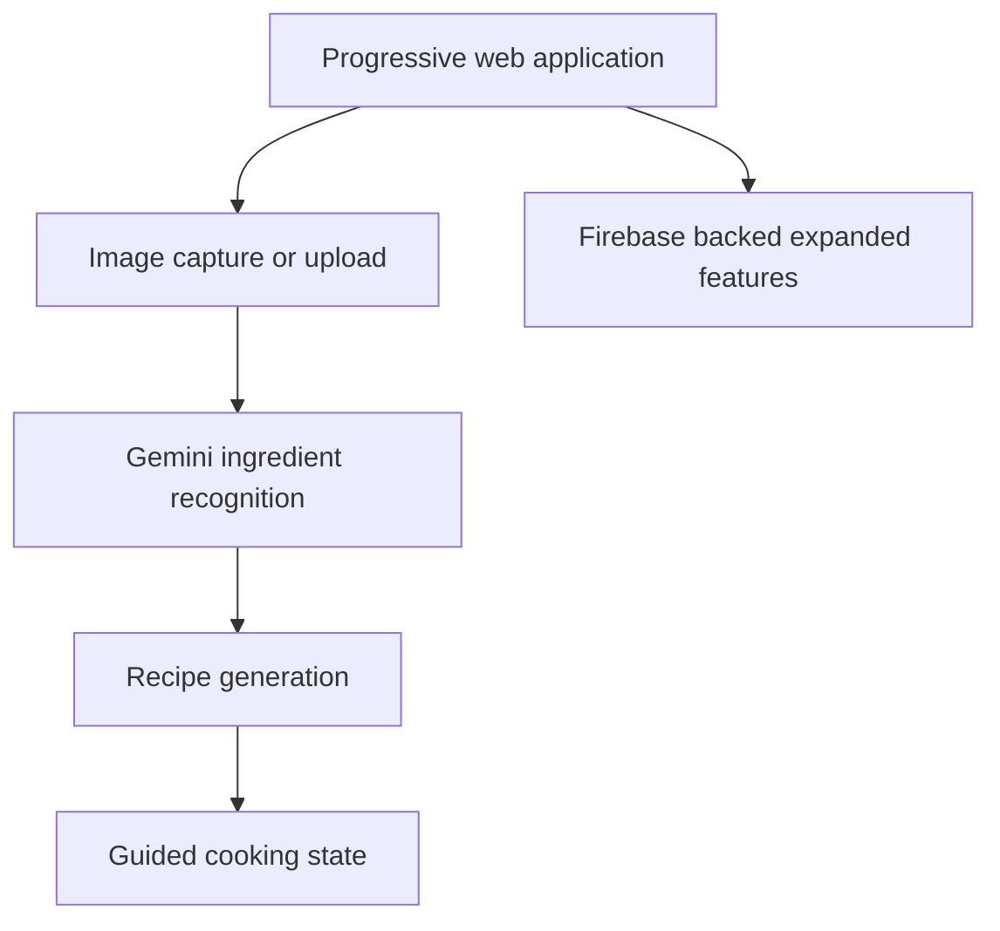

  

# ValueMunch

<!-- portfolio-status -->
## Project Status

ValueMunch is preserved as a hackathon case study. The original Firebase backed expanded demo has been retired. Source and planning materials remain available for review and local reproduction with a new cloud project. `pantry-io` is independently maintained and is not covered by this status note.

**Trae Hackathon project for turning pantry ingredients into guided meal ideas.**

ValueMunch creates a mobile friendly journey from a pantry photo to ingredient recognition, recipe suggestions, guided cooking, and a simple reward reveal.

## Demo Walkthrough

1. Upload or capture a pantry or kitchen image.
2. Detect visible ingredients and generate three recipe suggestions.
3. Select a recipe and follow its cooking steps.
4. Complete the recipe to reveal the reward experience.
5. Fall back to sample recipes when AI processing is unavailable.

## Architecture

## Public Repositories

| Repository | Purpose |
| --- | --- |
| [pantry-io](https://github.com/valuemunch/pantry-io) | Pantry photo to recipe progressive web application |
| [demo](https://github.com/valuemunch/demo) | Expanded React and Firebase meal discovery experience |
| [plan](https://github.com/valuemunch/plan) | Product flow, architecture, API, error handling, and interface planning documents |
| [hackathon](https://github.com/valuemunch/hackathon) | Initial Next.js hackathon scaffold |

## Note

The reward flow is simulated. Recipe and ingredient suggestions should be reviewed before cooking.

[Explore the repositories](https://github.com/orgs/valuemunch/repositories)
